# 如何应对 DDOS 攻击

## 什么是 DDOS 攻击

DDOS (Distributed Denial-of-Service) 攻击是指攻击者通过利用大量被恶意软件感染的计算机、软件的缺陷、互联网协议的弱点等，使得被攻击对象因为从不同来源收到大量非正常流量，从而导致大部分业务流量无法被正常处理。

由于网络协议由多层组成，业务流量要能从用户端到达游戏的服务器并被处理，需要各层都能正常工作，包括交换机、路由器、网卡、服务器等各种软硬件。只要其中任何一环失败，就能达成攻击者的目的。所以很多时候 DDOS 的效果并不会直接反映在服务器的负载上。不同的攻击也需要不同的方式应对。

## 被攻击时会发生什么

通常来说，当机房或云服务商检测到有个别租户被大量恶意流量攻击时，为了保护其它租户不受影响，会修改路由表把目标为被攻击 IP 地址的流量都路由到一个「黑洞」，也就是丢掉这些流量。这时用户就无法正常访问服务了。

如果是针对 HTTP 等应用层协议的攻击，可能会导致业务服务器负载过高，从而服务无法访问。

## 如何应对 DDOS 攻击

如果受到的是应用层攻击（比如 http/https 流量，表现为业务服务器或反向代理负载显著升高），接入云服务商提供的应用层防火墙（WAF，Web Application Firewall）能起到抗攻击的作用。但从过去的情况看，游戏受到的大部分是更低层的攻击，所以以下重点讨论更常见的情况。

被攻击时成本最低也能最快完成的方案是换 IP。也就是为服务器分配一个新的 IP，把老的 IP 去掉，然后把域名指向新的 IP。这多半不能解决问题，因为攻击者发现域名解析变了之后会开始攻击新的 IP。但因为操作快、成本低，可以先尝试，以尽量减少服务不可用的时间。在少数情况下，攻击者是针对 IP 而不是域名进行攻击，可能就彻底解决了（比如你并不是攻击目标，而是被误伤的情况）。

通常来说能持续有效的方式是接入高防服务。防 DDOS 攻击的难点是把攻击流量和业务流量区分开，高防服务提供的流量清洗就是用专业的设备和机房来以比较高的准确率隔离攻击流量，让业务流量可以到达业务服务器。各大型云服务商均会提供防 DDOS 攻击服务，也有专门提供这类服务的公司。

通常来说，攻击者会找到业务域名对应的 IP，对此 IP 发起攻击：

需要注意的是，简单地启用防 DDOS 服务，并把原 IP 作为回源 IP 是起不到任何作用的，因为攻击者已经知道原 IP，会对它进行持续攻击。

正确地做法是为业务分配新的 IP 作为防 DDOS 服务的回源 IP（新分配的 IP 不要在任何地方公布，也不要用任何域名指向它），把业务域名指向高防 IP，并把原 IP 从业务服务器解绑。

在国内，由于防 DDOS 服务价格较为昂贵，另外流量会经过额外的环节而增加网络延迟，通常只会在受到攻击时，和在开服或上榜等可能被攻击前接入此类服务。因为临时接入高防需要时间，建议如果能预期到在特定时间点被攻击的可能性较大，就提前接入避免服务中断产生损失。在国外可以选用 Cloudflare 等自带 DDOS mitigation 功能的动态 CDN 来同时达到降低网络延迟和常态防 DDOS 的效果。
